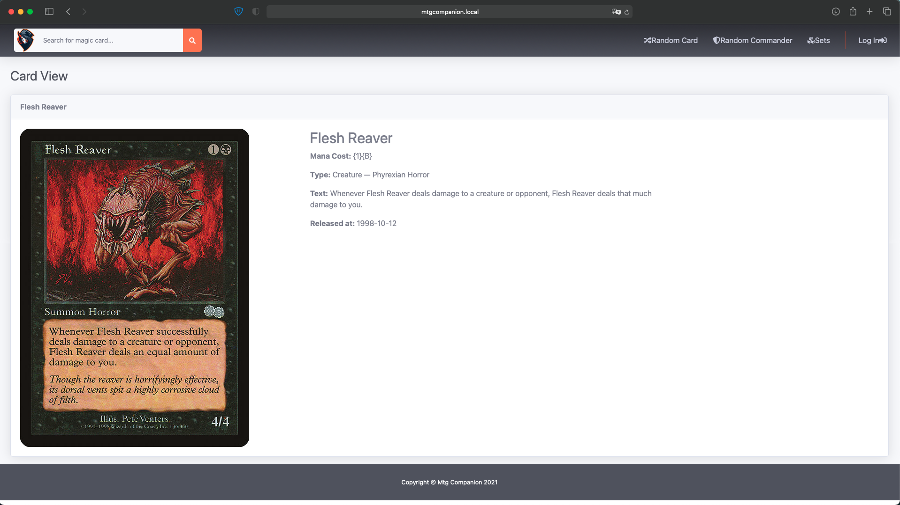

#MTG - Companion

A web application to search and manage your card collection, based on Scryfall API.

##Images

You can search cards by his text: 

Get a random Card or Commander: 

Or get all sets: 

---

##Installation

 - Clone this repository
 - On the Docker directory, inside the project, set the path to your cloned project.

- Create a new directory to store the database outside the docker, and again, set the path on docker compose.

- Next step, copy the .env.example, with the name '.env' and configure it, wi will tell laravel the url name,
  'mtgcompanion.local', and configure the database with the data on docker-compose.
  

- Now run the `docker-compose up --build` command, and the dockers will run.

- We need to enter inside the php docker to execute some instructions for the project, we enter inside with 
docker 'exec -it [contianer name] /bin/bash'

- Once inside the docker we run `composer install` to install the project dependencies, and once this is done  
`php artisan migrate` to generate the DDBB. And finally generate the Apikey with `php artisan key:generate`

- And now we can go to the browser: 

